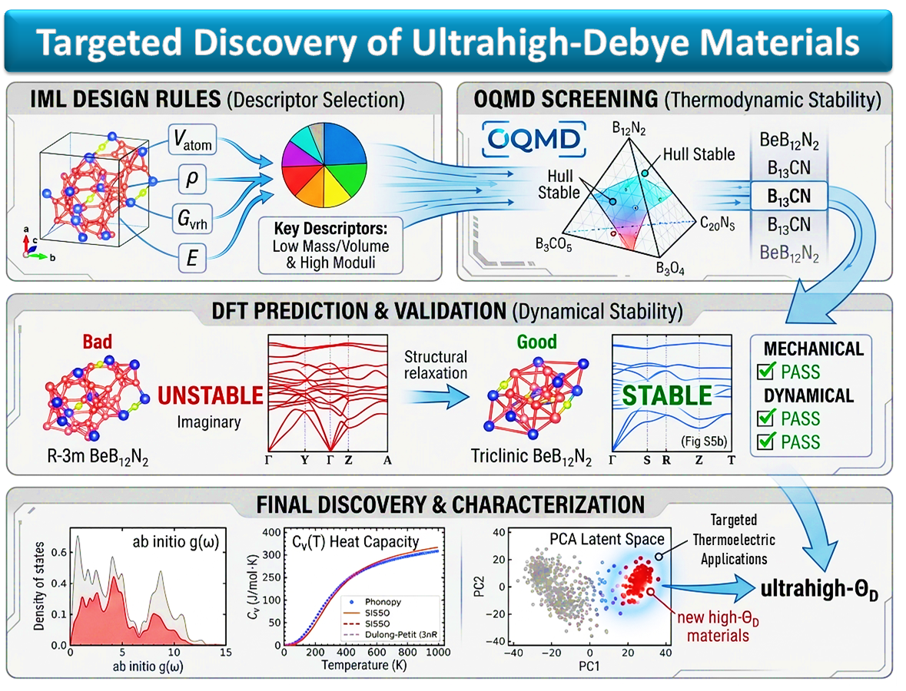

# New Predicted Materials
---
This repository contains **ab initio validation data and related post-processing tools** for 26 novel inorganic compounds predicted to exhibit high Debye temperatures ($\Theta_D$). The candidate materials were identified using interpretable machine learning design rules derived from PLS, SISSO, CRA, and PCA analyses, and subsequently validated through first-principles density functional theory (DFT) calculations.

---
> **Note:** This is a sub-repository of the main project:  
> **[Physics-Informed-Symbolic-Regression-for-Phonon-Related-Property-Prediction-and-Materials-Discovery](https://github.com/Shaswat-qm-researcher/Physics-Informed-Symbolic-Regression-for-Phonon-Related-Property-Prediction-and-Materials-Discovery/)**

<p align="center">
  
</p>

---
## Table of Contents

1. [Repository Structure](#1-repository-structure)
2. [Contents Overview](#2-contents-overview)
3. [Predicted Compounds](#3-predicted-compounds)
4. [Data Provenance](#4-data-provenance)
5. [Citation](#5-citation)

---

## 1. Repository Structure

```
NEW_PREDICTED_MATERIALS/
│
├── 📁 ab_initio_calculations_results/
├── 📁 python_postprocessing_codes/
└── 📄 predicted_structures_material_properties.xlsx
````

**→ Jump to:** 
[ab\_initio\_calculations\_results](./ab_initio_calculations_results/README.md) 
[python\_postprocessing\_codes](./python_postporcessing_codes/README.md)

---

## 2. Contents Overview

### [`ab_initio_calculations_results/`](./ab_initio_calculations_results/README.md)

 DFT input/output files for all 26 compounds. One subfolder per compound containing three calculation modules.

| Module | Contents |
|---|---|
| `oqmd_structures/` | Original POSCAR and INCAR from OQMD |
| `DFT_elastic_data/` | VASP inputs and output for elastic constant calculation |
| `phonopy_calculations/` or `DFPT_Phonopy_calculations/` | Force constants, k-path, DOS, thermal properties, and post-processing figures |

> **Note:** All compounds use the finite-displacement Phonopy method except `BeB12N2 (Triclinic)`, which uses DFPT due to its low P1 symmetry.


### [`python_postprocessing_codes/`](./python_postporcessing_codes/README.md)

Python scripts to generate phonon dispersion and specific heat ($C_v$) plots.

| Script | Output |
|---|---|
| [`install.py`](./python_postporcessing_codes/install.py) | Installs and verifies all dependencies |
| [`FORCE_CONT_PHONON_DISPERSION.py`](./python_postporcessing_codes/FORCE_CONT_PHONON_DISPERSION.py) | Computes phonon dispersion relations and atom-projected phonon density of states (PDOS) from the `FORCE_CONST` file, while enforcing symmetry constraints and acoustic sum rules. |
| [`cv_comparison_plot_phonopy_vs_SISSO.py`](./python_postporcessing_codes/cv_comparison_plot_phonopy_vs_SISSO.py) | $C_v$ vs $T$ comparison: Phonopy vs SISSO vs Fitted Debye integral |

### [`predicted_structures_material_properties.xlsx`](./predicted_structures_material_properties.xlsx)

DFT calculated Property database covering all 26 predicted compounds. 
Each row is one compound; columns include:

| Category | Properties |
|---|---|
| OQMD reference | Entry ID, Structure ID, space group, total energy, band gap, formation energy, energy above hull |
| DFT elastic constants | Full Cij tensor, Voigt/Reuss/Hill bulk modulus, Young's modulus, shear modulus, Poisson's ratio, Pugh ratio, Vickers hardness (models 6 & 7), sound velocities |
| Phonopy thermodynamics | $C_v(T)$, $S(T)$, $E(T)$, $F(T)$ from $0–1000~\mathrm{K}$ |
| Debye temperatures | Anderson & SISSO-predicted (from elastic data) and Phonopy-fitted  |
---

## 3. Predicted Compounds

All 26 compounds are thermodynamically stable (energy above hull = 0 eV/atom on the OQMD convex hull), sorted here by SISSO-predicted $\Theta_D$.

| # | Formula | Space Group | Crystal System | $\Theta_D^{\mathrm{SISSO}}~\mathrm{(K)}$ | $\Theta_D^{\mathrm{Phonopy}}~\mathrm{(K)}$ |
|---|---|---|---|---|---|
| 1 | [BeB₁₂N₂ (Trigonal)](./ab_initio_calculations_results/BeB12N2%20(Trigonal)/) | R-3m | Trigonal | 1514.7 | 1513.0 |
| 2 | [BeB₁₂N₂ (Triclinic)](./ab_initio_calculations_results/BeB12N2%20(Triclinic)/) | P1 | Triclinic | 1437.7 | 1382.4 |
| 3 | [B₁₃CN](./ab_initio_calculations_results/B13CN/) | R3m | Trigonal | 1471.7 | 1373.0 |
| 4 | [BeB₂](./ab_initio_calculations_results/BeB2/) | Cmcm | Orthorhombic | 1407.6 | 1171.9 |
| 5 | [LiB₁₅](./ab_initio_calculations_results/LiB15/) | Imma | Orthorhombic | 1324.6 | 1257.7 |
| 6 | [Be₁₇V₂](./ab_initio_calculations_results/Be17V2/) | R-3m | Trigonal | 1217.4 | 940.7 |
| 7 | [TiBeC](./ab_initio_calculations_results/TiBeC/) | P1 | Triclinic | 1096.7 | 970.9 |
| 8 | [CrN₂](./ab_initio_calculations_results/CrN2/) | P6₃/mmc | Hexagonal | 1062.7 | 1103.2 |
| 9 | [Be₃Cr₂B](./ab_initio_calculations_results/Be3Cr2B/) | Cmcm | Orthorhombic | 1038.9 | 879.0 |
| 10 | [Be₇Cr₄B](./ab_initio_calculations_results/Be7Cr4B/) | Amm2 | Orthorhombic | 1000.4 | 875.0 |
| 11 | [Mn₂BeB₂](./ab_initio_calculations_results/Mn2BeB2/) | P4/mbm | Tetragonal | 997.4 | 885.9 |
| 12 | [LiBeB](./ab_initio_calculations_results/LiBeB/) | P2₁/m | Monoclinic | 956.7 | 909.4 |
| 13 | [MnBe₂](./ab_initio_calculations_results/MnBe2/) | P6₃/mmc | Hexagonal | 939.4 | 850.3 |
| 14 | [Si₃N₄](./ab_initio_calculations_results/Si3N4/) | P6₃ | Hexagonal | 936.8 | 1111.8 |
| 15 | [Ti₆Be₂₃](./ab_initio_calculations_results/Ti6Be23/) | Fm-3m | Cubic | 896.5 | 878.2 |
| 16 | [Ti₃C₂N](./ab_initio_calculations_results/Ti3C2N/) | P-3m1 | Trigonal | 894.6 | 811.9 |
| 17 | [Ti₆C₅](./ab_initio_calculations_results/Ti6C5/) | C2/m | Monoclinic | 860.0 | 801.7 |
| 18 | [Ti₆C₄N](./ab_initio_calculations_results/Ti6C4N/) | C2/m | Monoclinic | 855.0 | 806.6 |
| 19 | [Li₄BeN₂](./ab_initio_calculations_results/Li4BeN2/) | R-3m | Trigonal | 840.6 | 803.3 |
| 20 | [Li₄C₃](./ab_initio_calculations_results/Li4C3/) | C2/m | Monoclinic | 801.0 | 803.8 |
| 21 | [V₈CN₃](./ab_initio_calculations_results/V8CN3/) | P2 | Monoclinic | 748.7 | 697.1 |
| 22 | [BeV₃N](./ab_initio_calculations_results/BeV3N/) | Cmcm | Orthorhombic | 730.8 | 699.5 |
| 23 | [Cr₂N](./ab_initio_calculations_results/Cr2N/) | P-31m | Trigonal | 712.2 | 634.8 |
| 24 | [Mn₂Be](./ab_initio_calculations_results/Mn2Be/) | I4/mmm | Tetragonal | 699.8 | 632.9 |
| 25 | [Cr₂₃C₆](./ab_initio_calculations_results/Cr23C6/) | Fm-3m | Cubic | 674.3 | 572.4 |
| 26 | [Mn₈CN₃](./ab_initio_calculations_results/Mn8CN3/) | P1 | Triclinic | 657.0 | 606.5 |

Full elastic, thermodynamic, and structural data for all compounds are in [`predicted_structures_material_properties.xlsx`](./predicted_structures_material_properties.xlsx).

---

## 4. Data Provenance

| Source | Details |
|---|---|
| Crystal structures | [Open Quantum Materials Database (OQMD)](http://oqmd.org); Entry IDs listed in the xlsx |
| DFT code | VASP 5.x; PAW pseudopotentials (see [`psudo_potentials_details.xlsx`](./ab_initio_calculations_results/psudo_potentials_details.xlsx)) |
| Phonon code | [Phonopy](https://phonopy.github.io/phonopy/) 2.x; finite-displacement method (most compounds) or DFPT (BeB₁₂N₂ triclinic) |
| SISSO model | Parent repository — symbolic regression trained on DFT materials descriptors |

---

## 5. Citation

>If you use this data, please cite:
