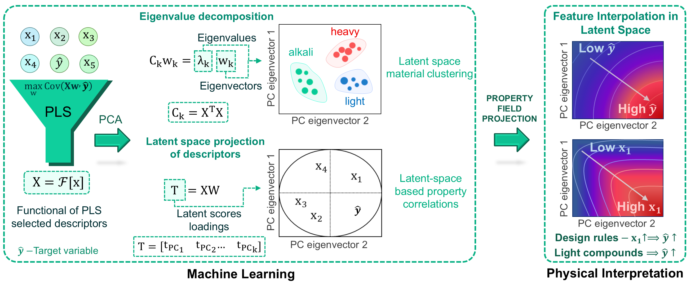

# PCA Interpretable Clustering

A two-stage pipeline that classifies materials by chemical species and decomposes the descriptor feature space via PCA — revealing how material families cluster in latent property space and which descriptors drive the separation. Applied to **Debye temperature** ($\Theta_D$) prediction using elastic and volumetric descriptors from [Materials Project](https://materialsproject.org/) and [AFLOW](http://aflow.org/).

<p align="center">
  
</p>


---
> **Note:** This is a sub-repository of the main project:  
> **[pisr-phonon-genesis](https://github.com/Shaswat-qm-researcher/pisr-phonon-genesis/)**

---

## Table of Contents
1. [Repository Structure](#repository-structure)
2. [Workflow](#workflow)
3. [Files](#files)
4. [Analyses Performed](#analyses-performed)
5. [Outputs](#outputs)
6. [Runtimes](#runtimes)
7. [Requirements](#requirements)
8. [Citation](#citation)

---

## Repository Structure

```
📁 pca-interpretable-clustering/
├── 📓 pca_data_classifier.ipynb            # Stage 1 — chemical classification (interactive)
├── 📓 PCA_interpretable_clusstering.ipynb  # Stage 2 — PCA analysis (interactive)
├── 🐍 material_classification_hpc.py       # Stage 1 — HPC/batch version
├── 🐍 pca_analysis_hpc.py                  # Stage 2 — HPC/batch version
│
├── ⚙️  Material_classification_PCA.txt      # Config for material_classification_hpc.py
├── ⚙️  PCA_config.txt                       # Config for pca_analysis_hpc.py
│
├── 📊 PCA_data_unclassified.csv            # Raw input dataset (Materials Project + AFLOW)
├── 📄 symbol_conversion.txt                # Column → LaTeX label mapping (PDF figures)
├── 📄 symbol_conversion_html.txt           # Column → HTML label mapping (interactive plot)
├── 🌐 pca_scatter_inject.html              # Custom UI panel injected into interactive plot
│
├── 📋 requirements.txt                     # Pinned Python dependencies
├── 🔧 setup_env.py                         # One-command environment installer
│
├── 📁 classified_data/                     # Auto-generated by Stage 1
│   ├── 📊 Boride.xlsx
│   ├── 📊 Carbide.xlsx
│   ├── 📊 Element.xlsx
│   ├── 📊 Halide.xlsx
│   ├── 📊 Metal-Metalloid.xlsx
│   ├── 📊 Nitride.xlsx
│   ├── 📊 Other.xlsx
│   └── 📊 Oxide.xlsx
│
└── 📁 results/                             # Auto-generated by Stage 2
    ├── 📄 Count_vs_ThetaD.pdf
    ├── 📄 Nummaterials_vs_PC1_PC2.pdf
    ├── 📄 PCA_explained_variance.pdf
    ├── 📄 PCA_loadings.pdf
    ├── 📄 PCA_Scatter.pdf
    ├── 📄 Property_contours.pdf
    ├── 📄 Property_threshold_analysis.pdf
    ├── 📄 ThetaD_Stats_vs_PC1_PC2.pdf
    ├── 🌐 PCA_scatter_interactive.html
    └── 📊 PCA_results.xlsx
```

---

## Workflow

```
PCA_data_unclassified.csv
        │
        ▼
Stage 1 — pca_data_classifier.ipynb  /  material_classification_hpc.py
        │  Parses chemical formulas → assigns chemical class (priority rule-set)
        ▼
classified_data/
  Boride  Carbide  Element  Halide  Metal-Metalloid  Nitride  Other  Oxide  (.xlsx)
        │
        ▼
Stage 2 — PCA_interpretable_clusstering.ipynb  /  pca_analysis_hpc.py
        │  Standardises features → scikit-learn PCA → 8 analysis blocks
        ▼
results/   PDFs + Interactive HTML + Excel workbook
```

---

## Files

### Notebooks vs HPC Scripts

| Use Case | Stage 1 | Stage 2 |
|---|---|---|
| Local / interactive | `pca_data_classifier.ipynb` | `PCA_interpretable_clusstering.ipynb` |
| HPC / batch (no prompts) | `material_classification_hpc.py` | `pca_analysis_hpc.py` |

HPC scripts read all settings from their respective config files — no user input required.

### Config Files

**`Material_classification_PCA.txt`** — for `material_classification_hpc.py`:
```ini
file_path      = C:/PCA_data_unclassified.csv
output_dir     = C:/classified_data/
formula_column =        # leave blank for auto-detect (looks for: species, formula, composition)
```

**`PCA_config.txt`** — for `pca_analysis_hpc.py`:
```ini
data_folder         = C:/classified_data
file_subset         =           # blank = all .xlsx files; or serial numbers / filenames
feature_columns     =           # blank = SM, YM, VPA, D, DT (all defaults)
n_cpus              = 1         # increase for parallel data loading on HPC
save_dir            = C:/
save_name           = pca_results
symbol_file         = C:/symbol_conversion.txt
interactive_scatter = yes       # requires plotly
inject_file         = C:/pca_scatter_inject.html
symbol_file_html    = C:/symbol_conversion_html.txt
show_labels         = no
```

### Supporting Files

| File | Purpose |
|---|---|
| `symbol_conversion.txt` | `KEY = $LaTeX$` mappings used in all PDF figures |
| `symbol_conversion_html.txt` | `KEY = HTML` mappings (e.g. `<sub>`) used in interactive hover labels |
| `pca_scatter_inject.html` | Custom side-panel UI injected into the Plotly HTML — required for the full interactive experience |

> The interactive scatter plot (`PCA_scatter_interactive.html`) can be generated without `pca_scatter_inject.html`, but the custom annotation panel will be absent. Set `inject_file =` blank in config to skip injection.

### Input Dataset — `PCA_data_unclassified.csv`

| Column | Symbol | Description |
|---|---|---|
| `formula` | — | Chemical formula (used for classification) |
| `VPA` | $V_\mathrm{atom}$ | Volume per atom (ų/atom) |
| `D` | $\rho$ | Mass density (g/cm³) |
| `SM` | $G_{VRH}$ | Shear modulus, Voigt–Reuss–Hill (GPa) |
| `YM` | $E$ | Young's modulus, Voigt–Reuss–Hill (GPa) |
| `DT` | $\Theta_D$ | Debye temperature — target property (K) |

### Chemical Classification Categories

| Class | Display Name | Description |
|---|---|---|
| `Element` | Single Element | Pure elemental solids |
| `Metal-Metalloid` | Metal & Metalloid Compounds | Intermetallics and metal–metalloid compounds |
| `Boride` | Borides | Metal/metalloid borides |
| `Carbide` | Carbides | Metal/metalloid carbides |
| `Nitride` | Nitrides | Metal/metalloid nitrides |
| `Oxide` | Oxides | Oxygen-containing compounds |
| `Halide` | Halides | Halogen-containing compounds |
| `Other` | Other Compounds | Everything else |

---
## Analyses Performed

**1. Explained Variance Decomposition:** Per-component cumulative explained variance ratioa, identifying how many PCs are needed to capture most of the descriptor variance.

**2. PC Loadings:** Descriptor loadings (eigenvector components) of the first two principal components, illustrating the correlations between physical quantities and identifying which descriptors contribute most strongly to each principal axis, along with the direction of their influence.

**3. PC1 vs PC2 Scatter Map:** Scatter plot of all materials projected onto the PC1–PC2 space, coloured and labeled by chemical class. This visualization highlights intrinsic clustering, chemical family separation, and underlying similarities in the latent descriptor space. Helping to indentify material families for targeted design.

**4. Interactive Scatter Plot (HTML):** A Plotly-powered HTML file of the same scatter map, enabling hover-to-inspect for each of the 11,000+  compounds (formula, class, input properties, $\Theta_D$) and interactive zoom/pan.

**5. $\Theta_D$ Statistics vs PC1 / PC2:** Binned mean $\pm$ standard deviation profiles of Debye temperature along PC1 and PC2 axes, with a 10th–90th percentile band -- directly linking position in PCA space to target property value.

**6. Material Count vs $\Theta_D$ Distribution:** Histogram with smoothed KDE envelope of the $\Theta_D$ distribution, segmented by chemical class.

**7. Property Contour Maps:** Feature values ($G_{VRH}$, $E$, $V_\mathrm{atom}$, $\rho$, $\Theta_D$) interpolated and plotted as filled contour maps on the PC1–PC2 grid, giving a spatially resolved view of how each descriptor varies across latent space.

**8. Property Threshold Analysis:** Tabulates minimum and maximum descriptor values within the LOW and HIGH $\Theta_D$ ranges, quantifying the property values associated with extreme target values.

---

## Outputs

| File | Description |
|---|---|
| `PCA_explained_variance.pdf` | Scree plot — per-component and cumulative variance ratio |
| `PCA_loadings.pdf` | Descriptor loadings onto PC1 and PC2 |
| `PCA_Scatter.pdf` | Static PC1 vs PC2 scatter coloured by chemical class |
| `ThetaD_Stats_vs_PC1_PC2.pdf` | Binned $\Theta_D$ mean ± std profiles along PC1 and PC2 |
| `Count_vs_ThetaD.pdf` | $\Theta_D$ distribution histogram with KDE, segmented by class |
| `Nummaterials_vs_PC1_PC2.pdf` | Material count density projected onto the PC1–PC2 plane |
| `Property_contours.pdf` | Interpolated contour maps of all features on the PC1–PC2 grid |
| `Property_threshold_analysis.pdf` | Descriptor ranges at low and high $\Theta_D$ thresholds |
| `PCA_scatter_interactive.html` | Plotly scatter — hover for formula, $\Theta_D$, class; zoom/pan; custom UI panel |
| `PCA_results.xlsx` | PC coordinates, loadings, explained variance, per-class statistics, threshold tables |

---

## Runtimes

Benchmarked on AMD Ryzen 7 7735HS (8 cores / 16 threads, 3.20 GHz base), 16 GB DDR5 @ 4800 MT/s, `n_cpus = 1`:

| Phase | Time |
|---|---|
| Data loading | 00:03 |
| Block 1 — Explained variance | 00:03 |
| Block 2 — Scatter plots | 00:14 |
| Block 3 — Count vs PC1/PC2 | 00:04 |
| Block 3 — $\Theta_D$ stats vs PC | 00:04 |
| Block 3 — $\Theta_D$ distribution | 00:06 |
| Block 3 — Contour maps | 00:29 |
| Block 3 — Property projections | 00:43 |
| Block 4 — Threshold analysis | 00:29 |
| **Total wall-clock** | **02:41** |

> Contour maps and property projections dominate runtime. Increase `n_cpus` in `PCA_config.txt` for parallel data loading on multi-core nodes.

---

## Requirements

See [`requirements.txt`](requirements.txt) and [`setup_env.py`](setup_env.py).

| Package | Version |
|---|---|
| Python | 3.12.12 (Anaconda) |
| numpy | 1.26.4 |
| pandas | 2.2.3 |
| matplotlib | 3.9.2 |
| scikit-learn | 1.5.2 |
| scipy | 1.14.1 |
| seaborn | 0.13.2 |
| plotly | 6.5.2 |
| openpyxl | 3.1.2 |

```bash
# Recommended: create a dedicated environment
conda create -n pca_env python=3.12 anaconda && conda activate pca_env

# Then install
python setup_env.py
# or
pip install -r requirements.txt
```

---

## Citation

If you use this code or dataset in your work, please cite:

> 
---
**Data sourced from:**
- [Materials Project](https://materialsproject.org/) — A. Jain *et al.*, APL Materials 1, 011002 (2013).
- [AFLOW](http://aflow.org/) — S. Curtarolo *et al.*, Computational Materials Science 58, 218 (2012).
